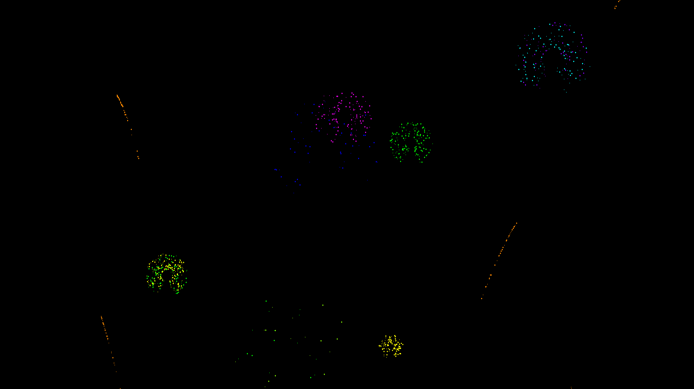

# Fireworks

Virtual firework for the lonely hours at home.
Written in SDL2 and C++ in about two hours on new year's eve 2021.
Might continue working on it next year.

  

## Usage

Start the program and enjoy.
You can click for more rockets and press 'Q' to quit.
Happy new year!
